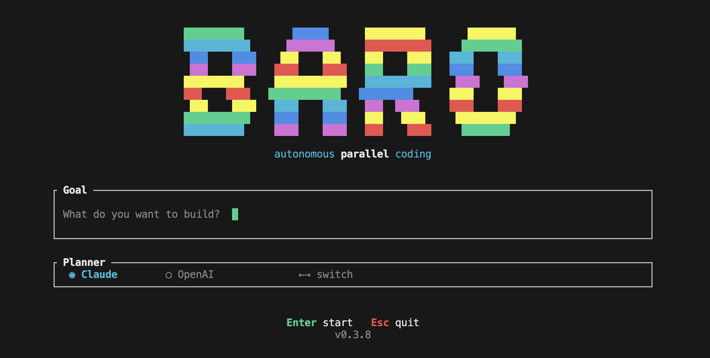

# baro

## Background Agent Runtime Orchestrator

Give it a goal, it breaks it into stories, builds a dependency DAG, and runs them in parallel — each story gets its own AI agent.

  



## Install

```
npm install -g baro-ai
```

Requires [Claude CLI](https://docs.anthropic.com/en/docs/claude-cli) installed and authenticated.

## Usage

```bash
# Interactive - opens welcome screen
baro

# Direct - skip to planning
baro "Add authentication with JWT and role-based access control"

# Use OpenAI for planning
baro --planner openai "Add WebSocket support"

# Resume interrupted execution
baro --resume

# Specify working directory
baro --cwd ~/projects/myapp "Add unit tests"
```

## How it works

1. **Plan** — Claude explores your codebase and generates a dependency graph of user stories
2. **Review** — You review the plan, accept or quit
3. **Execute** — Stories run in parallel on a feature branch, each with its own Claude agent
4. **Review Agent** — After each level completes, a review agent checks the work against acceptance criteria and creates fix stories if needed
5. **Finalize** — Creates a GitHub PR with summary when all stories complete

## Features

- **Parallel execution** — independent stories run simultaneously, respecting dependency order
- **DAG engine** — topological sort with level grouping, cycle detection
- **Live TUI** — dashboard with story status, live agent logs, DAG view, stats
- **Review agent** — automated code review between levels, auto-fix with retry
- **Build detection** — auto-detects project type (Cargo, npm, Go, Python, Make) and runs builds during review
- **Git coordination** — mutex-protected commits, auto-push with retry, pull --rebase, conflict detection
- **Branch per run** — creates `baro/<name>` branch, keeps main clean
- **Resume** — detects `prd.json` and resumes incomplete executions
- **PR creation** — creates GitHub PR via `gh` CLI when done
- **Retry logic** — failed stories retry automatically (configurable per story)
- **Claude + OpenAI** — Claude as default planner/executor, OpenAI as alternative planner

## Requirements

- [Claude CLI](https://docs.anthropic.com/en/docs/claude-cli) installed and authenticated
- macOS (arm64/x64) or Linux (x64/arm64)
- Node.js 18+ (only if using `--planner openai`)
- `gh` CLI (optional, for PR creation)

## Architecture

Rust binary distributed via npm. TUI built with ratatui, async execution with tokio, one Claude CLI process per story.

## License

MIT
